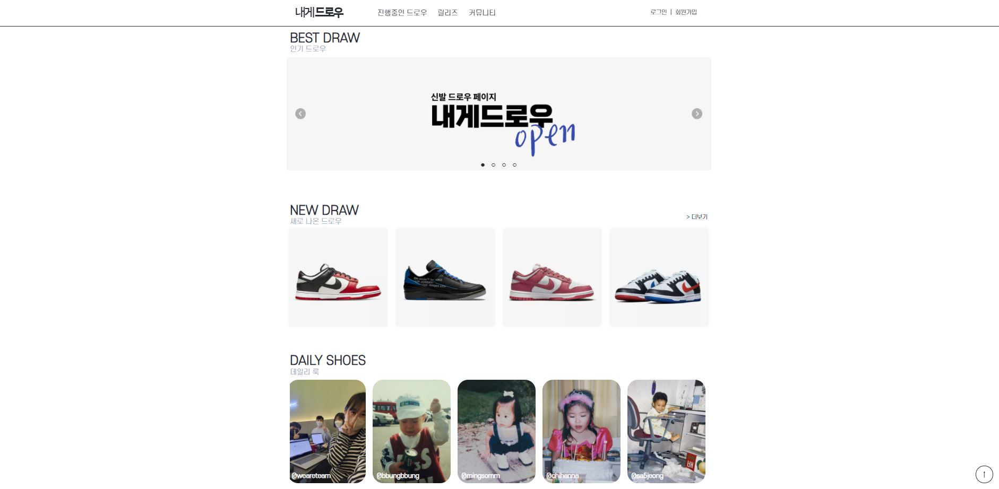
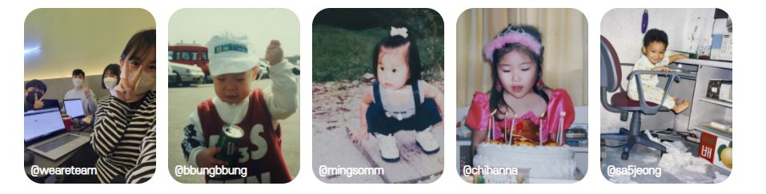

# 1. 내게드로우



  
한정판 스니커즈 발매 소식과 응모 정보를 제공하는 웹사이트  
  
  


# 2. 개발환경


# 3. 구조
```
DrawToMe
├─assets  
├─build
│ ├─assets
│ │     ├─images
│ │     ├─videos
│ ├─css
│ ├─images
│ ├─js
│ ├─detail.html
│ ├─drawlist.html
│ ├─index.html
├─src
│ ├─assets                  # 사용된 이미지, 비디오 
│ │     ├─images
│ │     ├─videos
│ ├─sass      
│ │     ├─base              # 기본 스타일 초기화 
│ │     ├─components        
│ │     ├─layout            # 헤더, 푸터, 내비게이션 등 공통 영역  
│ │     ├─pages             # 페이지별 레이아웃 
│ │     ├─utils             # 미디어쿼리 및 mixin 
│ │     ├─index.scss         
│ ├─js
│ ├─detail.html
│ ├─drawlist.html
│ ├─index.html
│ ├─detail.js
│ ├─drawlist.js
│ ├─index.js
├─.babelrc
├─.env
├─.gitignore
├─README.md
├─package-lock.json
├─package.json
├─postcss.config.js
├─webpack.config.js

``` 


# 4. 프로젝트 실행 
```
npm i
npm run start
```

# 5. 만든 사람들   



- [원종빈](https://github.com/JJongBin) @sa5jeong
- [김민성](https://gtihub.com/minsoftk) @bbungbbung
- [박민지](https://github.com/urther) @mingsomm
- [최한나](https://github.com/hann3) @chihanna
  
    
    
    


